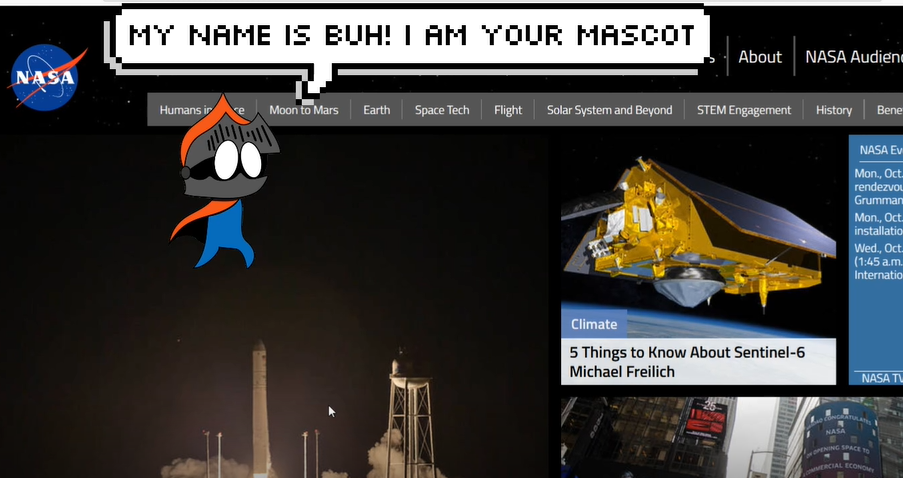

# Buh Mascot

   

-----------------

#  Buh Mascot

Our mascot is called Buh he is a fictional character! It can be activated manually or selected.
Buh should be installed on your browser (as if it were a puglin) because according to your search (search) it will offer you something more playful for you to learn.
Do not be alarmed because it can appear from Surprise. Offering the User the option to “play” to learn about a certain Theme.
When verifying what you were going to search a game with the options you chose is emulated.

Learn and have fun with BUH!

## Authors
 
- [Tomaz Macedo](https://github.com/tomazalexandre)  
- [Wesley Mendes](https://github.com/WesGtoX)  
